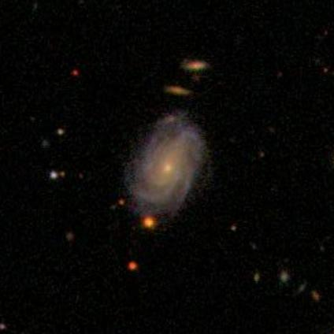

# Galaxy-classification-ML-model

This repo contains the code I used to train a CNN based on ResNet-50. It takes optical images of galaxies as an input and predicts their morphological class.

## Background

Galaxy morphology (e.g. spiral vs elliptical) is a key observable for understanding how galaxies form and evolve. Projects like Galaxy Zoo have collected millions of visual classifications from citizen scientists, but upcoming surveys (e.g. LSST, Euclid) will observe far more galaxies than can be inspected by humans.  

A good quality image based classifier can (a) reproduce human labels at scale, and (b) free expert time for rare or ambiguous objects.

Example images:

## Problem Statement

Given optical images of galaxies, we want to train a convolutional neural network (CNN) based on ResNet-50 to automatically classify galaxies into simple morphological classes (e.g. spiral vs elliptical) using high-confidence Galaxy Zoo labels.

Concretely:

- Inputs: cut-out images of galaxies in optical bands.
- Outputs: class probabilities for each morphology (currently spiral / elliptical; “uncertain” objects excluded from training).

## Objectives

- Join Galaxy Zoo morphology tables with filename mappings to build a clean training set.
- Filter out low-confidence / “uncertain” classifications.
- Extract and organise galaxy images into class-specific folders.
- Fine-tune a ResNet-50 CNN on this dataset.
- Evaluate classification performance and inspect typical successes/failures.

## KPIs

- **Classification performance**
  - Overall accuracy and macro F1-score on a held-out test set.
  - Per-class precision/recall (spiral vs elliptical).
- **Quality & reliability**
  - Stable performance across different train/validation splits.
  - Reasonable probability calibration (confidence vs correctness).
  - Model accurately predicts galaxy classifications for images from outside the train/test dataset e.g. from the Hubble Space Telescope.
- **Reproducibility**
  - The end-to-end pipeline (catalog join -> image selection -> training) can be rerun from the repo with minimal manual steps.

## Stakeholders

- Astronomers working on galaxy evolution and morphology.
- Survey teams needing fast, automated classifications.
- Citizen-science projects (e.g. Galaxy Zoo) wanting ML assistance or cross-checks.
- Students and researchers learning about deep learning for astronomy.

## Data

This project uses Galaxy Zoo catalogue tables and SDSS image cutouts.

CSV and mapping files:

- `GalaxyZoo1_DR_table2.csv` – Galaxy Zoo catalogue with morphology information.
- `gz2_filename_mapping.csv` – mapping between catalogue IDs and image filenames.
- `joined_galaxies_table.csv` – result of joining the above tables (uncertain galaxies removed).
- `joined_galaxies_with_existing_images_table.csv` – joined table restricted to galaxies with available image files.

Images are organised into class-specific folders (spiral / elliptical) for training.

## Repository Structure

- `GalaxyZoo1_DR_table2.csv`  
  Raw Galaxy Zoo catalogue with morphology information.

- `gz2_filename_mapping.csv`  
  Mapping between Galaxy Zoo IDs and SDSS image filenames.

- `joined_galaxies_table.csv`  
  Joined catalogue (Galaxy Zoo + filename mapping), with “uncertain” objects removed.

- `joined_galaxies_with_existing_images_table.csv`  
  Subset of the joined catalogue restricted to galaxies for which image files actually exist.

- `images_gz2/`
  - `images/`  
    Full set of original Galaxy Zoo/SDSS jpeg cutouts.
  - `useful_images/`  
    Images selected for training/testing:
    - `ellipticals/` – elliptical galaxy images used for training and evaluation.
    - `spirals/` – spiral galaxy images used for training and evaluation.

- `PyTorch_Gal_Class_Model_Training/`
  - `Gal_class_model_generate.py`  
    Main PyTorch script for loading the ResNet-50–based model and running training.
  - `fc_model_0.pth`, `fc_model_1.pth`, `fc_model_opt.pth`  
    Saved model checkpoints/optimised fully connected layers.
  - `deployment/`
    - `fc_model_opt.pth` – model checkpoint prepared for deployment.
    - `run.py` – simple script to load the deployment model and run predictions.
    - `run_share.py` – helper/sharing script for running the model elsewhere.
  - `prediction/`
    - `prediction.py` – script to run the trained model on example images.
    - `elliptical_to_test.jpg`, `elliptical_to_test_ii.jpg` – example elliptical galaxies for testing.
    - `spiral_to_test.jpg`, `spiral_to_test_ii.jpg` – example spiral galaxies for testing.
    - `fc_model_opt.pth` – checkpoint used by the prediction script.

- `join_tables.py`  
  Joins `GalaxyZoo1_DR_table2.csv` with `gz2_filename_mapping.csv`, drops “uncertain” galaxies, and writes `joined_galaxies_table.csv`.

- `select_useful_images.py`  
  Reads `joined_galaxies_table.csv` and copies images into `images_gz2/useful_images/spirals` and `images_gz2/useful_images/ellipticals`.

- `1254.jpg`, `1380.jpg`  
  Individual example galaxy images from the train/test data.

The images used as test/train in this project are available from https://data.galaxyzoo.org/#section-8 

If wishing to reproduce the training in this Git repo, these images should be downloaded and the file paths referenced in the repo's scripts should be appropriately updated.

The trained model effectively classifies higher quality images of lower redshift galaxies. For example:

